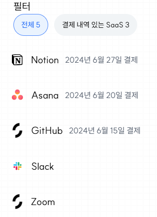
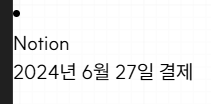

## 목록과 필터 컴포넌트 테스트하기

### 요구사항과 경우의 수 파악하기

처음으로 실습할 예제는 SaaS 목록을 만들어보는 예제입니다. 개발할 때 잘 정리된 케이스나 명세를 받기도 합니다만. 개발자가 기획 단계부터 협업을 하거나, 테스트 케이스나 요구사항을 구체화하고 명세해야 할 때도 많습니다. 다음 스크린샷을 보시죠.



한 번 어떤 케이스들과 요구사항이 있을지 생각해봅시다. 실무였다면 모호한 부분은 누군가에게 물어보기도 할 겁니다. 저는 다음과 같이 정리해보았습니다.

1. Notion이나 Asana 같이 구독하고 있는 SaaS의 목록을 보여줍니다.
2. SaaS는 이름과 로고, 그리고 최근 결제한 날짜가 있습니다.
 - 이름은 필수이지만, 로고는 없을 수도 있습니다. 로고가 없으면 디폴트 이미지를 보여줍니다.
  - 최근 결제한 날짜는 없을 수도 있습니다. 최근에 결제한 SaaS가 위로 올라옵니다.
3. 각 항목은 해당 SaaS의 상세 페이지로 가는 링크입니다.
4. 필터가 있습니다. 전체와 결제 내역이 있는 SaaS, 두 가지가 있고요. 필터된 SaaS의 개수를 옆에 보여줍니다. 선택한 필터에 해당하는 SaaS만 보여줍니다.

테스트 케이스는 다양한 경우의 수를 커버해야 합니다. 그러면 여기서 어떤 경우의 수가 중요할까요?

1. 결제 내역과 로고가 둘 다 있는 경우
2. 결제 내역이 없는 경우
3. 로고가 없는 경우
4. 둘 다 없고 이름만 있는 경우

등이 떠오릅니다. 그러면 이 4가지 경우마다 테스트 데이터를 만들어줘야겠네요.

### 스토리북과 픽스처 준비하기

그러면 이제 본격적으로 제대로 된 컴포넌트를 만들고 테스트를 해봅시다.

혹시 이미 켜두시지 않았다면, 터미널 탭을 3개 열고 next server, 스토리북, 테스트를 하나씩 켜줍시다.

```sh
pnpm dev
# 다른 터미널을 새로 열고
pnpm story
# 또 다른 터미널을 새로 열고
pnpm test
```

먼저 가장 귀찮은 일부터 합시다. 테스트 데이터를 만들고 스토리북을 만드는 것입니다.

이런 테스트 데이터는 AI에게 기본 틀을 짜달라고 하면 편합니다만. 그래도 인간의 손을 거치지 않으면 뒤통수를 맞는 경우가 많습니다. (제가 예제를 만들다가 뒤통수를 맞아서 이렇게 쓴 게 맞습니다) 저는 다음과 같이 만들어 보았습니다.

```tsx
// domains/saas/SaasList/SaasListItem.fixture.tsx

import { SaasListItem } from "./SaasListItem";

export const 로고_결제내역_있는_SaaS = {
	id: "ef4cdc19-a393-478f-8caf-9d1ab7f7a82e",
	name: "Notion",
	logoUrl: "https://assets-dev.smply.app/saas-logos/9-IepQ3Rrt.png",
	lastPaidAt: new Date("2024-06-27"),
};

export const 결재내역_없는_SaaS = {
	id: "c54e160e-feb2-4545-b0a4-a2ed7f70e6d2",
	name: "Slack",
	logoUrl:
		"https://assets-global.website-files.com/621c8d7ad9e04933c4e51ffb/65eba5ffa14998827c92cc01_slack-octothorpe.png",
};

export const 로고_없는_SaaS = {
	id: "a983512a-4daf-45b0-892d-d7e8399d982b",
	name: "GitHub",
	lastPaidAt: new Date("2024-06-15"),
};

export const 이름만_있는_SaaS = {
	id: "469413ca-1c22-480a-8adc-7f6b00d17324",
	name: "Zoom",
};

export default {
	"로고 결제내역 있는 SaaS": <SaasListItem saas={로고_결제내역_있는_SaaS} />,
	"결재내역 없는 SaaS": <SaasListItem saas={결재내역_없는_SaaS} />,
	"로고 없는 SaaS": <SaasListItem saas={로고_없는_SaaS} />,
	"이름만 있는 SaaS": <SaasListItem saas={이름만_있는_SaaS} />,
};
```

그러면 SaasListItem이 없으니 타입스크립트 컴파일러가 화를 낼 겁니다.

> File '/home/taehee/github/turing-frontend-test/src/app/domains/saas/SaasList/SaasListItem.tsx' is not a module.ts(2306)

`is not a module` 은 해당 파일에서 export한 게 없다는 뜻입니다. SaasListItem 컴포넌트 함수를 만들고 export를 해줍시다.

```tsx
// domains/saas/SaasList/SaasListItem.tsx
export const SaasListItem = ({
	saas,
}: {
	saas: {
		id: string;
		name: string;
		logoUrl?: string;
		lastPaidAt?: Date;
	};
}) => {
};
```

아니 그런데 여전히 컴파일러가 화를 냅니다.

> 'SaasListItem' cannot be used as a JSX component.
  Its type '({ saas, }: {    saas: {        id: string;        name: string;        logoUrl?: string;        lastPaidAt?: Date;    };}) => void' is not a valid JSX element type.

void는 함수가 반환하는 값이 없다는 뜻입니다. 보통 jsx를 리턴하는 걸 까먹으면 나는 에러입니다. 일단 li를 하나 반환하게 합시다. 화면에도 `test!`가 보여야겠죠?

```tsx
// domains/saas/SaasList/SaasListItem.tsx
export const SaasListItem = ({
	saas,
}: // ...
) => {
    <li>test!</li>
};
```

아니 여전히 같은 에러가 납니다. 화면에도 아무 것도 안 보이고요. 왜일까요? `return`을 빼먹었기 때문입니다. 이렇게 간단한 거에서도 실수하는데. 복잡한 코드를 짜면 왜 흰 화면만 나오는 거야 30분 동안 고민하다가 동료에게 질문하는 일이 생겨서, 실제 경험담으로 강의에서 소개하게 될지도 모르겠군요.

```tsx
// domains/saas/SaasList/SaasListItem.tsx
export const SaasListItem = ({
	saas,
}: // ...
) => {
    return <li>test!</li>; // <- return을 까먹지 말자
};
```

와와. Test는 한 줄도 짜지 않았는데, 타입 에러를 고치다보니 TDD를 한 것 같죠? 이런 걸 Type Driven Development라고 하기도 합니다.

하지만 여기에서 타입의 한계도 마주치게 됩니다. 실제로 구현된 건 하나도 없는데 타입 에러가 더 이상 나지 않는군요. 물론 경고가 뜨긴 합니다.

> 'saas' is declared but its value is never read

이제 테스트를 작성하고 하나씩 구현을 할 시간입니다.

### 테스트 먼저 작성하고 구현하기

먼저 더 단순한 이름만 있는 SaaS부터 시작해봅시다. 우리는 요구사항을 웹 표준과 접근성의 언어로 변환해야 합니다. 이름만 있는 SaaS에 우리는 뭘 기대할까요?

- 이름이 보인다.
- 결제 일자는 보이지 않는다.

아, 물론 그렇게 생각할 수도 있습니다. 하지만 이름은 그저 텍스트일까요? 아까 보여드린 이미지 -피그마처럼 생각하셔도 됩니다-에서 최근 결제일은 좀 더 연한 글씨로 덜 강조되는데, SaaS의 이름은 진한 글씨로 강조하고 있습니다.

이렇듯 어떤 listitem의 제목은 보통 h3 같은 `heading`으로 만듭니다. 그러니 다음처럼 작성할 수 있습니다.

```ts
// domains/saas/SaasList/SaasListItem.test.tsx
import { render } from "@testing-library/react";
import SaasListItemStories from "./SaasListItem.fixture";
import { describe, test } from "vitest";
import { expectTL } from "@/siheom/expectTL";
import { queryTL } from "@/siheom/queryTL";

describe("SaasListItem", () => {
	test("이름만 있는 SaaS", async () => {
		render(SaasListItemStories["이름만 있는 SaaS"]);

		await expectTL(queryTL.heading("Zoom")).toBeVisible();
		await expectTL(queryTL.text("결제")).not.toBeVisible();
	});
});
```

이러면 당연하게도 테스트는 실패합니다.

```sh
 FAIL  src/app/domains/saas/SaasList/SaasListItem.test.tsx > SaasListItem > 이름만 있는 SaaS
 TestingLibraryElementError: Unable to find role="heading" and name `/Zoom/i`
 Ignored nodes: comments, script, style
 <body>
   <div>
     <li>
       test!
     </li>
   </div>
 </body>
```
에러를 읽어봅시다. 이름에 Zoom 을 포함하고 있는 heading을 찾지 못했다네요. 화면에는 임시로 넣어놓은 test! 만 보입니다.

이걸 고치는 건 쉽죠. h3를 추가합시다.

```tsx
// domains/saas/SaasList/SaasListItem.tsx
export const SaasListItem = ({
	saas,
}: // ...
) => {
    return <li><h3>{saas.name}</h3></li>; // <- return을 까먹지 말자
};
```

와와. PASS 를 보셨나요? 아직 경우의 수가 많습니다. 결제내역이 있는 경우는 어떨까요? 날짜는 그저 `text`일 뿐 입니다만. 날짜를 기대하는대로 포매팅해주는 게 좀 귀찮습니다.

```ts
// domains/saas/SaasList/SaasListItem.test.tsx
// ...

describe("SaasListItem", () => {
	test("이름만 있는 SaaS", async () => {
		render(SaasListItemStories["이름만 있는 SaaS"]);

		await expectTL(queryTL.heading("Zoom")).toBeVisible();
		await expectTL(queryTL.text("결제")).not.toBeVisible();
	});

    // 새 테스트 케이스를 추가!
	test("로고 결제내역 있는 SaaS", async () => {
		render(SaasListItemStories["로고 결제내역 있는 SaaS"]);

		await expectTL(queryTL.heading("Notion")).toBeVisible();
		await expectTL(queryTL.text("2024년 6월 27일 결제")).toBeVisible();
	});
});
```

또 테스트가 실패합니다.

```sh
FAIL  src/app/domains/saas/SaasList/SaasListItem.test.tsx > SaasListItem > 로고 결제내역 있는 SaaS
TestingLibraryElementError: Unable to find an element with the text: 2024년 6월 27일 결제. This could be because the text is broken up by multiple elements. In this case, you can provide a function for your text matcher to make your matcher more flexible.
```

음 이번에는 text가 없다네요. 그러면 구현을 합시다. `date-fns` 같은 라이브러리를 쓸 수도 있지만, 일단 직접 해봅시다.

```tsx
function formatDateYearMonthDate(date: Date): string {
	return `${date.getFullYear()}년 ${date.getMonth() + 1}월 ${date.getDate()}일`;
}

export const SaasListItem = ({
	saas,
}: // ...
) => {
	return (
		<li>
			<h3>{saas.name}</h3>
			<p>{formatDateYearMonthDate(saas.lastPaidAt)} 결제</p>
		</li>
	);
};
```

와와 통과!... 일줄 알았는데 깨집니다.

```sh
 × 이름만 있는 SaaS
 ✓ 로고 결제내역 있는 SaaS

 FAIL  src/app/domains/saas/SaasList/SaasListItem.test.tsx > SaasListItem > 이름만 있는 SaaS
TypeError: Cannot read properties of null (reading 'getFullYear')
 ❯ formatDateYearMonthDate src/app/domains/saas/SaasList/SaasListItem.tsx:2:17
      1| function formatDateYearMonthDate(date: Date): string {
      2|  return `${date.getFullYear()}년 ${date.getMonth() + 1}월 ${date.getDate()}일`;
       |                 ^
      3| }
```

이런 결제내역이 있는 경우는 성공했는데, 없는 경우가 터졌군요. 타입스크립트도 같이 빨간 줄이 뜨고 있습니다.

> Argument of type 'Date | null' is not assignable to parameter of type 'Date'.<br/>
>  Type 'null' is not assignable to type 'Date'.ts(2345)

어떻게 하면 될까요? 조건부로 렌더하면 null 에러가 사라질 겁니다. 후후.


```tsx
function formatDateYearMonthDate(date: Date): string {
	return `${date.getFullYear()}년 ${date.getMonth() + 1}월 ${date.getDate()}일`;
}

export const SaasListItem = ({
	saas,
}: // ...
) => {
	return (
		<li>
			<h3>{saas.name}</h3>
			{saas.lastPaidAt && <p>{formatDateYearMonthDate(saas.lastPaidAt)} 결제</p>}
		</li>
	);
};
```

와와 그러면 모든 테스트가 통과합니다. 누군가 null 에러를 없앤다고 !를 쓴 게 은밀하게 코드리뷰를 통과해서 배포된 앱이 오픈 첫날에 터지는 일은 없겠군요.

```sh
✓ src/app/domains/saas/SaasList/SaasListItem.test.tsx (2)
  ✓ SaasListItem (2)
    ✓ 이름만 있는 SaaS
    ✓ 로고 결제내역 있는 SaaS

Test Files  1 passed (1)
     Tests  2 passed (2)
  Start at  19:53:13
  Duration  6.76s (transform 0ms, setup 595ms, collect 57ms, tests 73ms, environment 0ms, prepare 530ms)

PASS  Waiting for file changes...
```

### 링크 테스트의 아쉬움

아직 SaaS 항목들은 눌러도 아무 일도 일어나지 않는 li 일 뿐입니다. 그러면 링크인지는 어떻게 테스트할까요? 실제로 눌러보고 해당 페이지로 이동하는지 보는 것도 좋습니다만. component 테스트에서는 보통 선언적으로, 해당 페이지로 가능 링크만 가지고 있는지 보는 게 보통입니다.

```ts
test("항목은 해당 SaaS의 상세 페이지로 가능 링크다", async () => {
    render(SaasListItemStories["로고 결제내역 있는 SaaS"]);

    await expectTL(queryTL.link("Notion")).toHaveAttribute('href', `/saas/${로고_결제내역_있는_SaaS.id}`);
});
```

이를 구현하는 것도 간단합니다. 저는 귀찮더라도 NextLink를 감싸서 Link 컴포넌트를 만들어서 사용했습니다.

```tsx
// src/app/routing/Link.tsx
import NextLink from "next/link";
import type { PropsWithChildren } from "react";

export const Link = ({
	className,
	href,
	children,
}: PropsWithChildren<{ className?: string; href: string }>) => {
	return (
		<NextLink className={className} href={href}>
			{children}
		</NextLink>
	);
};
```

```tsx
import { Link } from "@/app/routing/Link";
// ...

// ...
<li>
    <Link href={`/saas/${saas.id}`}>
        <h3>{saas.name}</h3>
        {saas.lastPaidAt && <p>{formatDateYearMonthDate(saas.lastPaidAt)} 결제</p>}
    </Link>
</li>
```

하지만 여기에는 실제로 페이지를 이동해보는 것에 비하면, 좀 아쉬운 부분이 있습니다. 일단 실제로 `/saas/[saas-id]`라는 페이지가 정의되었는지 보장해주지 않습니다. 업무를 하다보면 실수로 페이지의 경로에 오타를 내거나, 페이지 경로를 `/saas/`에서 `/saas-detail/`로 바꾸는 식의 작업을 할 때도 있을텐데 말이죠. 실제로 저희는 아직 saas 상세 페이지를 정의하지 않았는데 타입 에러도, 테스트도 깨지지 않고 있습니다.

그래서 모든 경로를 Path.ts 같은 폴더를 만들어서 정의해서 쓰는 분도 있고요. clojure 생태계에서 사용하는 reitit router에서는 route들을 데이터로 정의하고, link의 route가 정의되지 않으면 href를 만들어주지 않아서 에러를 던졌습니다. 웹 표준에 따르면 href가 없으면 a 태그여도 link가 아니기 때문이죠.

최근에는 tanstack router가 typed route를 개척했고요. remix나 nextjs도 실험적 기능이나 외부 플러그인 등으로 type 안전한 routing을 지원하고 있으니 참고해보시길 바랍니다.

### 스토리북과 스타일

타입도 테스트도 만족 시켰지만. 스토리북을 보면 빠진 게 있다는 걸 쉽게 알 수 있습니다.



이미지는 그러면 어떻게 테스트하면 좋을까요? 물론 alt text에 이상한 걸 넣고 나는 테스트를 짜는 훌륭한 개발자야 하고 자화자찬할 수도 있습니다만. 이미지가 text로 대체되는 게 아니라면 `role="presentation"`을 달고 `alt=""`로 비워주는 게 맞습니다.

> alt="saas 로고 이미지" 라거나 alt="saas 기본 이미지" 같이 무의미한 테스트용 정보를 alt에 넣지 마십시오. 접근성은 장난도 아니고 테스트용 기능도 아닙니다. (엄격 근엄 진지)

그러면 테스트 대신에 어떻게 하면 좋을까요? 그런 이유로 스토리북이 있습니다. 스토리북에서 눈으로 보면서 확인하세요. 물론 세상에는 스냅샷 테스트 혹은 visual test 라고 부르는 도구들도 있습니다만. 그 친구들도 그 나름의 심연이 있고 나중에 설명해보려 합니다.

이때도 이왕이면 최대한 실제 의존성을 쓰시면 좋습니다. 테스트 환경에서는 local image를 쓰더라도 실제 cdn이나 정적 이미지 서빙하는 서버가 죽거나 해서 이미지가 안 보이면 큰일 이니까요. (실제로 그런 이유로 이미지 서버가 죽었는데 사용자 문의가 올 때까지 방치된 채 페이지를 여럿 봤습니다)

여튼 이미지를 디폴트 값과 함께 렌더해주고, 스타일을 넣어주면 예쁜 스토리북을 볼 수 있습니다.

### 목록의 역할 각 항목의 역할

저희는 지금 목록을 만드는데 SaasList보다 SaasListItem을 먼저 작업하고 있습니다. 이건 꽤 흔한 패턴이기도 합니다.

보통 각 항목들은 경우의 수가 다양합니다. 저는 그래서 보통 다양한 경우의 수마다 항목별로 스토리북을 만들어서 테스트를 합니다.

목록은 보통 정렬을 하거나, 필터를 하거나, 무한 스크롤을 하기 때문에. 목록 컴포넌트에서는 이러한 상위 수준의 기능을 테스트하고는 합니다.

그러면 이제 목록 테스트로 들어가봅시다.

### 정렬을 테스트하기

일단 아까 요구사항을 되새겨봅시다. 최근에 결제된 SaaS가 앞에 와야 했습니다. 이를 테스트로 작성하려니... 귀찮습니다. 어떻게 하면 좋을까요?

이때 쓰기 좋은 꼼수가 승인 테스트(approval test)입니다.

일단 간단하게 구현을 합니다.

```tsx
"use client";
import { SaasListItem } from "./SaasListItem";

export const SaasList = ({
	saasList,
}: {
	saasList: {
		id: string;
		name: string;
		logoUrl: string | null;
		lastPaidAt: Date | null;
	}[];
}) => {

	return (
        <ul aria-label="SaaS 목록">
            {saasList
                .map((saas) => (
                    <SaasListItem key={saas.id} saas={saas} />
                ))}
        </ul>
	);
};
```

일단 빈 값을 넣어서 테스트를 실패하게 만듭니다. `toHaveTextContents` 는 query한 요소들이 기대한 텍스트를 가지고 렌더되는지 봅니다. 주로 리스트를 테스트할 때 쓰려고 만들었습니다.

```tsx
import { render } from "@testing-library/react";
import SaasListStories from "./SaasList.fixture";
import { describe, test } from "vitest";
import { expectTL } from "@/siheom/expectTL";
import { queryTL } from "@/siheom/queryTL";

describe("SaasList", () => {
	test("결제 내역 있는 SaaS만 필터할 수 있다", async () => {
		render(SaasListStories["Saas가 여럿 있음"]);

		// given 최근 결제일 순으로 정렬됨
		await expectTL(queryTL.listitem("")).toHaveTextContents([
		  // 일부러 빈 배열을 넣습니다.
        ]);
	});
});
```

그러면 당연히 테스트가 실패합니다. 빈 값이 아니니까요.

```sh

 FAIL  src/app/domains/saas/SaasList/SaasList.test.tsx > SaasList > 결제 내역 있는 SaaS만 필터할 수 있다
AssertionError: expected [ 'Notion2024년 6월 27일 결제', …(4) ] to deeply equal []

Ignored nodes: comments, script, style
<html>
... 이하 생략

- Expected
+ Received

- Array []
+ Array [
+   "Notion2024년 6월 27일 결제",
+   "Slack",
+   "GitHub2024년 6월 15일 결제",
+   "Zoom",
+   "Asana2024년 6월 20일 결제",
+ ]
```

그러면 저 배열의 실제 값(Received)을 그대로 복사해서 저희 테스트에 넣습니다. 그리고 눈으로 보고 직접 정렬하면 됩니다. 27일 20일 15일 slack, zoom 순서로 말이죠.

```ts
import { render } from "@testing-library/react";
import SaasListStories from "./SaasList.fixture";
import { describe, test } from "vitest";
import { expectTL } from "@/siheom/expectTL";
import { queryTL } from "@/siheom/queryTL";

describe("SaasList", () => {
	test("결제 내역 있는 SaaS만 필터할 수 있다", async () => {
		render(SaasListStories["Saas가 여럿 있음"]);

		// given 전체 SaaS 필터 체크됨
		await expectTL(queryTL.radio("전체 5")).toBeChecked();
		await expectTL(queryTL.list("SaaS 목록")).toBeVisible();

		// given 최근 결제일 순으로 정렬됨
		await expectTL(queryTL.listitem("")).toHaveTextContents([
			"Notion2024년 6월 27일 결제",
			"Asana2024년 6월 20일 결제",
			"GitHub2024년 6월 15일 결제",
			"Slack",
			"Zoom",
		]);
    })
})
```

그러면 당연히 테스트가 실패하겠죠. 저희 구현에서는 아직 정렬을 안 했으니까요.

```sh
- Expected
+ Received

  Array [
    "Notion2024년 6월 27일 결제",
-   "Asana2024년 6월 20일 결제",
-   "GitHub2024년 6월 15일 결제",
    "Slack",
+   "GitHub2024년 6월 15일 결제",
    "Zoom",
+   "Asana2024년 6월 20일 결제",
  ]
```

예상대로입니다. 정렬을 시킵시다.

```tsx
<ul aria-label="SaaS 목록">
    {saasList
        .sort(
            (a, b) =>
                (a.lastPaidAt?.valueOf() ?? 0) - (b.lastPaidAt?.valueOf() ?? 0),
        )
        .map((saas) => (
            <SaasListItem key={saas.id} saas={saas} />
        ))}
</ul>
```

아니 그런데 테스트가 실패합니다.

```sh
- Expected
+ Received

  Array [
-   "Notion2024년 6월 27일 결제",
-   "Asana2024년 6월 20일 결제",
-   "GitHub2024년 6월 15일 결제",
    "Slack",
    "Zoom",
+   "GitHub2024년 6월 15일 결제",
+   "Asana2024년 6월 20일 결제",
+   "Notion2024년 6월 27일 결제",
  ]
```

이런 정렬이 거꾸로 된 것 같네요? a와 b의 순서를 뒤집어봅시다.

```tsx
<ul aria-label="SaaS 목록">
    {saasList
        .sort(
            (a, b) =>
                (b.lastPaidAt?.valueOf() ?? 0) - (a.lastPaidAt?.valueOf() ?? 0),
        )
        .map((saas) => (
            <SaasListItem key={saas.id} saas={saas} />
        ))}
</ul>
```

와와 이번에는 성공입니다. 테스트 데이터에 값이 없는 경우도 포함되었으니 null 처리를 잘했는지도 같이 테스트가 되었네요. (한 번 null 처리 된 부분을 지워보시면 타입 에러도 나겠지만, test도 깨지는 걸 보실 수 있을 겁니다)

```sh
 ✓ src/app/domains/saas/SaasList/SaasListItem.test.tsx (3)
 ✓ src/app/domains/saas/SaasList/SaasList.test.tsx (1)

 Test Files  2 passed (2)
      Tests  4 passed (4)
   Start at  20:59:56
   Duration  836ms


 PASS  Waiting for file changes...
       press h to show help, press q to quit
```

### 필터를 테스트하기

이제는 필터를 구현해봅시다.

별도의 테스트 케이스를 작성할 수도 있지만, 저는 사용자가 아무 동작도 하지 않은 경우는 given으로 두고, 사용자의 동작을 시나리오로 작성하는 걸 더 선호합니다.

when 은 보통 사용자 동작이고 then은 보통 그렇게 변화된 UI의 상태입니다. 그러면 우리는 필터 기능에 어떤 시나리오를 기대할까요? 먼저 인간의 언어로 적어보자면 다음과 같습니다.

- given 원래 전체 5가 체크되어 있고, 5개가 모두 보였는데
- when 결제 내역 있는 SaaS 3 를 클릭하니
- then 결제 내역 있는 SaaS 3개만 보인다

여기서 잠시 궁금한 점은 `전체 5`나 `결제 내역 있는 SaaS 3`의 role이 무엇이냐는 건데요. 사람들은 div에 onClick을 달아서 쓰기도 합니다만. 우리는 생긴 것과 상관 없이 동작을 보고 역할을 생각해야 합니다.

- 페이지를 이동하거나 한다면 보통 `link` role 이고 `<a>` 태그를 사용합니다.
- 한 가지만 선택 가능한데 모든 선택지가 보인다면 `radio` role이고 `<input type="radio">`를 씁니다.
- 동시에 여러가지를 체크할 수 있고 모든 선택지가 보인다면 보통 `checkbox` role이고 `<input type="checkbox">`를 사용합니다.
- 값을 선택할 수 있는데 누르면 `option`들의 팝오버가 뜬다면 보통 `combobox` role이고 `<select>`를 씁니다. (사실 select는 combobox role의 표준을 따르지 않는데 좀 특이한 예외입니다.)
- 그 외에는 보통 `button` role이고 `<button>` 요소를 씁니다. 역할에 따라 role을 다르게 붙이기도 합니다. `role="tab"`이라거나요. 

그러면 여기서는 뭘 써야 할까요? filter를 url에 searchParams 등으로 넣는다면 `link`를 쓸 수도 있겠지만, 저희는 지역 상태로만 사용할 것이고, 한 번에 하나의 필터만 선택할 수 있기 때문에 `radio`가 맞습니다.

^^ 말은 길게 했지만 radio를 클릭하는 테스트 코드는 간단합니다.

```ts
test("결제 내역 있는 SaaS만 필터할 수 있다", async () => {
    render(SaasListStories["Saas가 여럿 있음"]);

    // given 전체 SaaS 필터 체크됨
    await expectTL(queryTL.radio("전체 5")).toBeChecked();
    await expectTL(queryTL.list("SaaS 목록")).toBeVisible();

    // given 최근 결제일 순으로 정렬됨
    await expectTL(queryTL.listitem("")).toHaveTextContents([
        "Notion2024년 6월 27일 결제",
        "Asana2024년 6월 20일 결제",
        "GitHub2024년 6월 15일 결제",
        "Slack",
        "Zoom",
    ]);

    // // when 결제 내역 있는 SaaS 라디오를 클릭하면
    // await queryTL.radio("결제 내역 있는 SaaS 3").click();

    // // then 결제 내역 있는 SaaS만 필터됨
    // await expectTL(queryTL.listitem("")).toHaveTextContents([
    //     "Notion2024년 6월 27일 결제",
    //     "Asana2024년 6월 20일 결제",
    //     "GitHub2024년 6월 15일 결제",
    // ]);
});
```

그러면 이제 하나씩 구현을 해봅시다. 일단 필터가 없으니 테스트가 깨질 겁니다.

```sh
FAIL  src/app/domains/saas/SaasList/SaasList.test.tsx > SaasList > 결제 내역 있는 SaaS만 필터할 수 있다
TestingLibraryElementError: Unable to find role="radio" and name `/전체 5/i`
```

전체라는 이름이 붙은 radio와 전체 SaaS의 개수를 세서 넣어줘야 합니다.

```tsx
// ...
import { useState } from "react";

export const SaasList = ({
	saasList,
}: {
	saasList: {
		id: string;
		name: string;
		logoUrl: string | null;
		lastPaidAt: Date | null;
	}[];
}) => {
	const [selected, setSelected] = useState("all");

	return (
		<VStack>
			<fieldset>
				<legend> 필터 </legend>
				<label>
					전체 {saasList.length}
					<input
						type="radio"
						value="all"
						checked={selected === "all"}
						onChange={() => {
							setSelected("all");
						}}
					/>
				</label>
			</fieldset>
            ...
        </VStack>
    );
}
```

### label과 input의 관계

여기서 주의할 점은 label 안에 input을 넣어야 label 안에 있는 text가 input의 접근 가능한 이름이 된다는 겁니다. 한 번 input을 label 밖으로 빼보시면 input을 찾지 못하고 테스트가 깨지는 걸 볼 수 있습니다.

input이 label 바깥에 있을 때에도 htmlFor과 id를 이용해서 연결해줄 수 있습니다. input에 id를 달고 label에 htmlFor로 id를 넣어주면 됩니다.

```tsx
<label htmlFor="all-radio">
    전체 {saasList.length}
</label>
<input
    id="all-radio"
    type="radio"
    value="all"
    checked={selected === "all"}
    onChange={() => {
        setSelected("all");
    }}
/>
```

이렇게 매번 id를 생각해내는 건 번거롭기도 하지만, 공용 컴포넌트에서도 문제가 되고요. id가 충돌할 가능성도 있기 때문에, react 18부터는 useId 훅으로 id를 생성할 수 있습니다.

```tsx
const id = useId()

<label htmlFor={id}>
    전체 {saasList.length}
</label>
<input
    id={id}
    type="radio"
    value="all"
    checked={selected === "all"}
    onChange={() => {
        setSelected("all");
    }}
/>
```

### 다시 필터 테스트하기

이제 앞서 주석처리했던 when 절을 다시 살려냅시다.


```ts
test("결제 내역 있는 SaaS만 필터할 수 있다", async () => {
    render(SaasListStories["Saas가 여럿 있음"]);

    // given 전체 SaaS 필터 체크됨
    await expectTL(queryTL.radio("전체 5")).toBeChecked();
    await expectTL(queryTL.list("SaaS 목록")).toBeVisible();

    // given 최근 결제일 순으로 정렬됨
    await expectTL(queryTL.listitem("")).toHaveTextContents([
        "Notion2024년 6월 27일 결제",
        "Asana2024년 6월 20일 결제",
        "GitHub2024년 6월 15일 결제",
        "Slack",
        "Zoom",
    ]);

    // when 결제 내역 있는 SaaS 라디오를 클릭하면
    await queryTL.radio("결제 내역 있는 SaaS 3").click();

    // // then 결제 내역 있는 SaaS만 필터됨
    // await expectTL(queryTL.listitem("")).toHaveTextContents([
    //     "Notion2024년 6월 27일 결제",
    //     "Asana2024년 6월 20일 결제",
    //     "GitHub2024년 6월 15일 결제",
    // ]);
});
```

그러면 또 테스트가 실패합니다.

```sh
 FAIL  src/app/domains/saas/SaasList/SaasList.test.tsx > SaasList > 결제 내역 있는 SaaS만 필터할 수 있다
TestingLibraryElementError: Unable to find role="radio" and name `/결제 내역 있는 SaaS 3/i`
```

최근 결제일이 있는 SaaS만 필터해서 radio를 하나 만듭시다.

```tsx
const saasWithPaymentList = saasList.filter(
    (saas) => saas.lastPaidAt instanceof Date,
);

// ...
<fieldset>
    <legend> 필터 </legend>
    <label>
        전체 {saasList.length}
        <input
            type="radio"
            value="all"
            checked={selected === "all"}
            onChange={() => {
                setSelected("all");
            }}
        />
    </label>
    <label>
        결제 내역 있는 SaaS {saasWithPaymentList.length}
        <input
            type="radio"
            value="with-payment"
            checked={selected === "with-payment"}
            onChange={() => {
                setSelected("with-payment");
            }}
        />
    </label>
</fieldset>
```

와와 그러면 또 테스트가 통과합니다. 이제 마지막 then 절을 살립시다.


```ts
test("결제 내역 있는 SaaS만 필터할 수 있다", async () => {
    render(SaasListStories["Saas가 여럿 있음"]);

    // given 전체 SaaS 필터 체크됨
    await expectTL(queryTL.radio("전체 5")).toBeChecked();
    await expectTL(queryTL.list("SaaS 목록")).toBeVisible();

    // given 최근 결제일 순으로 정렬됨
    await expectTL(queryTL.listitem("")).toHaveTextContents([
        "Notion2024년 6월 27일 결제",
        "Asana2024년 6월 20일 결제",
        "GitHub2024년 6월 15일 결제",
        "Slack",
        "Zoom",
    ]);

    // when 결제 내역 있는 SaaS 라디오를 클릭하면
    await queryTL.radio("결제 내역 있는 SaaS 3").click();

    // then 결제 내역 있는 SaaS만 필터됨
    await expectTL(queryTL.listitem("")).toHaveTextContents([
        "Notion2024년 6월 27일 결제",
        "Asana2024년 6월 20일 결제",
        "GitHub2024년 6월 15일 결제",
    ]);
});
```

그러면 테스트가 또 실패합니다. 필터는 했지만, 항상 전체 목록을 보여주고 있거든요.

```sh
- Expected
+ Received

  Array [
    "Notion2024년 6월 27일 결제",
    "Asana2024년 6월 20일 결제",
    "GitHub2024년 6월 15일 결제",
+   "Slack",
+   "Zoom",
  ]
```

선택된 필터가 전체일 때에만 전체 목록을 보여주도록 삼항 연산자로 구현을 해봤습니다.

```tsx
<ul aria-label="SaaS 목록">
    {(selected === "all" ? saasList : saasWithPaymentList)
        .sort(
            (a, b) =>
                (b.lastPaidAt?.valueOf() ?? 0) - (a.lastPaidAt?.valueOf() ?? 0),
        )
        .map((saas) => (
            <SaasListItem key={saas.id} saas={saas} />
        ))}
</ul>
```

그러면 모두 통과합니다! 이제 또 스타일링만 하면 되겠군요?

```sh
 ✓ src/app/domains/saas/SaasList/SaasListItem.test.tsx (3)
 ✓ src/app/domains/saas/SaasList/SaasList.test.tsx (1)

 Test Files  2 passed (2)
      Tests  4 passed (4)
   Start at  21:26:34
   Duration  1.23s


 PASS  Waiting for file changes...
       press h to show help, press q to quit
```

### 웹표준을 이용한 스타일링

이번에 링크와 라디오가 있었는데요. 저희는 테스트를 작성했지만, 스타일이 경우의 수마다 잘 들어갔는지는 어떻게 확인할까요? 예를들어 선택된 필터가 파란색이 되는지를 테스트해야 할까요? 물론 스토리북을 보는 것도 방법입니다만. 상태에 따라 className을 다르게 넣어주는 식으로 js 로직을 작성한다면 실수할 여지가 커지는 것도 사실입니다.

제가 추천드리는 방법은 접근성 aria attribute와 웹 표준을 활용하는 겁니다.

예를 들어 link에 hover하거나 키보드로 focus했을 때 스타일은 다음과 같이 쉽게 적용할 수 있습니다.

```css
a.saas-list-item {
    background: var(--gray-white);
}

a.saas-list-item:is(:hover, :focus-visible) {
    background: var(--gray-50);
}
```

check된 radio의 스타일은 어떻게 할까요? 역시 비슷하게 할 수 있습니다.

```css
label.filter-button {
    border-radius: 9999px;
    padding: 8px 12px;
    border-width: 1px;
    border-color: transparent;
    background-color: #f1f4f6;
    transition: all 0.125s ease-in-out;

    /* label 안의 input이 체크되어 있으면 파란색이 되게 합니다 */
    &:has(input:checked) {
        border-color: #4f89fb;
        background-color: #eaf3fe;
        color: #1863f6;
    }
}
```

이렇게 스타일을 작성하면, 저희는 실제로 input이 기대하는대로 체크되었는지만 테스트하면 됩니다. radio는 같은 name= attribute를 가진 radio 중에 하나만 선택되는 걸 보장해주기 때문에 해당 동작을 매번 테스트하지 않아도 되고요. radiogroup 을 따로 컴포넌트로 만들고, 타입을 통해 name prop이 없으면 type error가 나게 하면 더 믿을만해질 것 입니다.

이러한 최신 CSS의 기능들은 tailwind를 비롯한 다양한 스타일링 라이브러리도 잘 지원합니다. 저도 tailwind로 시작해서, saas, styled-component, pandacss 등 다양한 도구를 사용했는데요. [테일윈드 문서의 Handling Hover, Focus, and Other States 파트](https://tailwindcss.com/docs/hover-focus-and-other-states)처럼 자신이 사용하는 라이브러리 이름 + aria 나 hover, focus, checked 등으로 검색하시면 필요한 지식을 얻으실 수 있을 겁니다.

### 목차

- [하나. 브라우저 컴포넌트 테스트 환경 셋업하기](https://github.com/taehee-sp/turing-frontend-test/tree/main/src/app/cosmos)
- [둘. 목록과 필터 컴포넌트 테스트하기](https://github.com/taehee-sp/turing-frontend-test/tree/main/src/app/domains/saas/SaasList)  <- 지금 여기
- [셋. 폼 컴포넌트 테스트하기](https://github.com/taehee-sp/turing-frontend-test/tree/main/src/app/domains/member/MemberCreateForm)
- [넷. 헤드리스 컴포넌트로 만든 디자인 시스템 테스트하기](https://github.com/taehee-sp/turing-frontend-test/tree/main/src/app/common/components/SelectWithCombobox)
